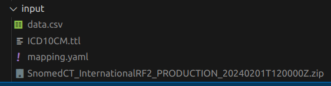

# Snakemake workflow: `Build Patient Knowledge Graph`

<!-- -->

A Snakemake workflow for creating a [patient knowledge graph](https://github.com/biocypher/patient-kg) from clinical data (e.g. ICD, Snomed CT, Loinc, german OPS). 

## Usage

Place the following files in the input folder:
- data.csv: Containing the clinical data. Mock example is included.
- mapping.yaml: Defines how data columns are mapped to underlying ontologies. Mock mapping for the data.csv is included.
- Snomed_CT_<release>.zip: Download a recent Snomed CT release (e.g. from [here](https://www.nlm.nih.gov/healthit/snomedct/international.html))
- Download the ICD10CM ontology file from [here](https://bioportal.bioontology.org/ontologies/ICD10CM) (select the RDF/TTL file).

Now you can run the workflow with `snakemake --cores 1`.

The workflow creates a Knowledge Graph from the input data. The edge files of the graph can be found in the `patient-kg/biocypher-out` directory.

<!--The usage of this workflow is described in the [Snakemake Workflow Catalog](https://snakemake.github.io/snakemake-workflow-catalog/?usage=<owner>%2F<repo>).

If you use this workflow in a paper, don't forget to give credits to the authors by citing the URL of this (original) <repo>sitory and its DOI (see above).-->

<!--# TODO

* Replace `<owner>` and `<repo>` everywhere in the template (also under .github/workflows) with the correct `<repo>` name and owning user or organization.
* Replace `<name>` with the workflow name (can be the same as `<repo>`).
* Replace `<description>` with a description of what the workflow does.
* The workflow will occur in the snakemake-workflow-catalog once it has been made public. Then the link under "Usage" will point to the usage instructions if `<owner>` and `<repo>` were correctly set.-->